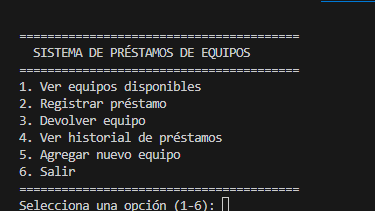
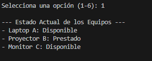
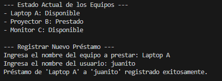
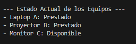
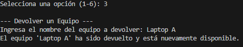
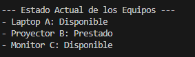
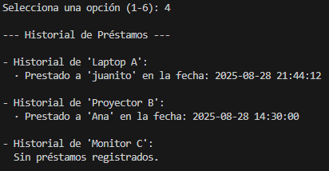
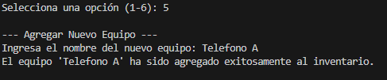
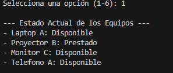
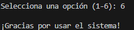

Explicacion: 

(equipos): Cada equipo esta en una biblioteca, y para saber si esta disponible estos tienen sus propios identificadores llamado disponible, con un valor bolleano, ademas, el valor de los prestamos va a guardar los datos de el usuario que contiene el prestamo solo si un nuevo prestamo ha sido agregado, sino, no contendra informacion.

(mostrar equipos): En este, primero se verifica si si hay equipos usando la palabra reservada not, pero, si hay, entonces primero va a ver el nombre y los datos en los items de los equipos (items siendo su contenido), luego, hace una condicion para revisar si el estado de los datos es true, si es true lo pone disponible, sino, lo muestra como prestado, y por ultimo muestra el nombre y el estado que ya definimos.

(registrar prestamo): Lo primero que hace es llamar a la funcion para mostrar equipos, luego de eso, continuamos con pedir el ingreso de un equipo para , luego, revisa si ese equipo esta en equipos, y luego revisa el valor de equipo_a_prestar, si esta disponible, entonces pide que se ingrese el nombre del usuario que va a obtener el prestamo, luego, obtiene la fecha del prestamo, pidiendo la fecha actual y organizandola por año, mes, dia, hora, minuto y segundo. Luego crea la tupla y la guarda en una variable como nuevo_prestamo, luego, incluye el equipo a prestar ingresado en prestamo, junto con el nuevo prestamo, despues, encuentra el equipo a prestar, si esta disponible lo cambia a false, osea, que ya no esta disponible, despues imprime todo segun el caso.

(devolver_equipo): Primero busca el equipo ingresado por el nombre, ahora busca ese equipo en la biblioteca, luego, si en equipos el equipo a devolver no esta disponible, cambia ese equipo a true (que ya esta disponible), y luego muestra el nombre del equipo a devolver segun el caso.

(ver historial): Primero revisa si hay equipos en el sistema, sino, muestra el mensaje acorde, en cambio, si hay equipos, primero, va a escanear, el nombre y los datos en los items de equipos, muestra el historial del nombre del equipo que ya miramos, despues revisa los datos en prestamos (usando el iterable de datos que preparamos para esto), luego, empezamos a recorrer la lista de tuplas en prestamos, revisando el usuario y la fecha en estos mismos, para finalmente mostrar el nombre del usuario y la fecha, asi completando el historial.

(Agregar equipo): Primero, deja que el usuario ingrese un nuevo equipo y lo guarda en una variable, luego, busca si esto esta en la bilbioteca, sino, entonces crea una nueva entrada, con la biblioteca y el nombre de nuestro nuevo equipo, le da los valores por defecto, y imprime que el nuevo equipo ha sido agregado.

(menu): El menu, siempre que la condicion del while se cumpla, va a mostrar, una linea hecha de iguales, en donde se del las opciones, y por ultimo, el programa se llama directamente desde la ultima linea.

(menu):

(Equipos disponibles):

(Registrar prestamo):

(Devolver equipo):

(Historial):

(Agregar equipo):

(terminar programa):

(clonacion del proyecto):
Para clonar el proyecto para su uso, escribir en la terminal, ubicados en donde queremos añadir el proyecto, escribir 'git clone https://github.com/mateousug/prestamos_equipos.git', por ci no sabes como hacerlo, antes de escribir este comando, escribe 'cd desktop' en la terminal.

(ejecucion):
Para ejecutarlo es importante que tengas python descargado y que tengas la extension de visual estudio para ello si estas usando visual studio, en la parte superior se podra ver este icono de play: , solo seleccionalo y si todo esta bien, deberia ejecutar esto en la terminal.